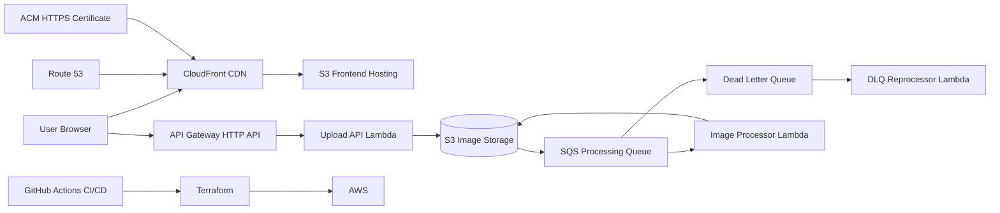

# AWS Event-Driven Image Processing Platform

Production-style serverless image processing platform built on AWS using event-driven architecture, Infrastructure as Code, and CI/CD automation.

## Live Demo

**Frontend (Custom Domain + HTTPS)**  
https://ipp.petkokolev-cloud.com

---

## Overview

This project evolved from a simple event-driven image processor into a production-style serverless web application.

Users can upload images through a browser UI, which are processed asynchronously by AWS services and returned as optimised outputs.

Key engineering concepts demonstrated:

- Event-driven architecture
- Asynchronous distributed processing
- Serverless backend APIs
- Infrastructure as Code (Terraform)
- CI/CD automation with GitHub Actions
- HTTPS delivery with custom domain
- AWS service integration and IAM permissions debugging

---

## Architecture



---

## How It Works

### Frontend Flow

1. User visits:

https://ipp.petkokolev-cloud.com

2. Static frontend is served from:

- S3
- CloudFront CDN
- HTTPS via ACM
- Route 53 custom DNS

3. User selects an image and clicks upload.

---

### Upload API Flow

Frontend sends request to API Gateway:

```text
POST /upload
```

API Lambda:

- detects content type
- generates presigned S3 upload URL
- returns:
  - upload URL
  - object key

Frontend uploads directly to S3.

This avoids routing file data through Lambda.

---

### Event Processing Flow

1. Image lands in:

```text
uploads/
```

2. S3 emits event notification

3. Event sent to SQS

4. Worker Lambda polls SQS

5. Worker:

- downloads original image
- processes/compresses image
- preserves correct file type
- writes output to:

```text
processed/
```

---

### Retrieval Flow

Frontend polls API until processed image becomes available.

API returns presigned access URL for the processed object.

---

## Architecture Decisions

### uploads/ vs processed/

Separate prefixes prevent recursive triggering.

Without this separation:

- processed images would trigger S3 events
- Lambda would process its own outputs
- infinite loop risk
- potential runaway AWS costs

AWS billing alerts during testing helped validate this safeguard.

---

### Presigned Uploads

Instead of uploading through API Gateway/Lambda:

- browser uploads directly to S3

Benefits:

- cheaper
- faster
- avoids Lambda payload limits
- better scalability

---

### CloudFront + Custom Domain

Frontend is production-hosted using:

- CloudFront CDN
- ACM-managed TLS
- Route 53 DNS

This replaces local development-only hosting.

---

### DLQ Pattern

Failed queue messages route to Dead Letter Queue.

Separate Lambda can reprocess failures.

Demonstrates resilience patterns used in production systems.

---

## Project Structure

```bash
backend/
├── api/
│   └── handler.py
├── worker/
│   └── worker.py

frontend/
├── index.html
└── styles.css

image-processing-pipeline/
├── lambda/
│   ├── image_processor/
│   │   ├── lambda_function.py
│   │   └── requirements.txt
│   └── dlq_reprocessor/
│       └── lambda_function.py
├── acm.tf
├── api.tf
├── dns.tf
├── frontend.tf
├── iam.tf
├── lambda.tf
├── provider.tf
├── s3.tf
└── sqs.tf

.github/
└── workflows/
    └── deploy.yml
```

---

## Infrastructure

Provisioned entirely using Terraform.

Resources include:

- S3 image storage bucket
- S3 frontend hosting bucket
- API Gateway HTTP API
- Upload API Lambda
- Image processing Lambda
- DLQ reprocessor Lambda
- SQS queue
- Dead Letter Queue
- IAM roles/policies
- ACM certificate
- CloudFront distribution
- Route 53 DNS records

---

## CI/CD

GitHub Actions automatically deploys on push to main.

Pipeline:

- builds Lambda deployment packages
- installs Lambda-compatible dependencies using Docker
- zips functions
- runs Terraform
- updates infrastructure
- uploads frontend assets to S3

---

## Challenges & Solutions

### Lambda Dependency Compatibility

Problem:

Pillow failed with:

```text
_imaging import error
```

Cause:

Dependencies built on macOS rather than Lambda Linux runtime.

Solution:

Used Lambda Docker base image:

```bash
public.ecr.aws/lambda/python:3.11
```

to package dependencies.

---

### AWS IAM Permission Debugging

Terraform deployments initially failed due to insufficient permissions for:

- ACM
- Route 53
- certificate validation
- DNS operations

Resolved by iteratively expanding least-privilege IAM policies.

---

### CloudFront ACM Region Constraint

CloudFront only accepts ACM certificates in:

```text
us-east-1
```

Solution:

Used Terraform provider alias for us-east-1 while keeping workload infra in eu-west-2.

---

### Event Loop Prevention

Prevented recursive Lambda execution by filtering:

```text
uploads/
```

only.

---

## Current Status

✅ Fully deployed production-style web application  
✅ Browser-based image upload UI  
✅ HTTPS custom domain hosting  
✅ Event-driven asynchronous image processing  
✅ S3 direct uploads via presigned URLs  
✅ API Gateway + Lambda backend  
✅ CI/CD deployment pipeline  
✅ Dead Letter Queue resilience pattern  
✅ JPG + PNG support  
✅ format preservation after processing

---

## Future Improvements

- EXIF orientation correction
- DynamoDB metadata storage
- EventBridge monitoring/reporting
- CloudWatch dashboards
- multiple processing modes (thumbnail / web / high quality)
- auth / user isolation
- drag-and-drop uploads
- progress event improvements

---

## Tech Stack

AWS:

- S3
- API Gateway
- Lambda
- SQS
- CloudFront
- Route 53
- ACM
- IAM

DevOps:

- Terraform
- GitHub Actions
- Docker

Backend:

- Python

Frontend:

- HTML
- CSS
- JavaScript
