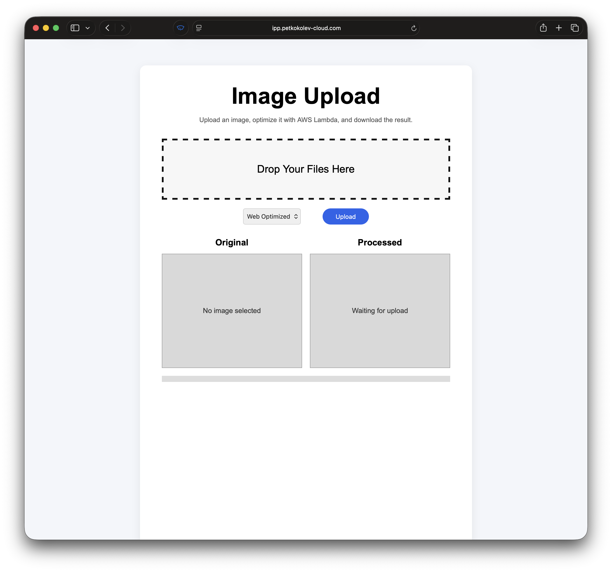
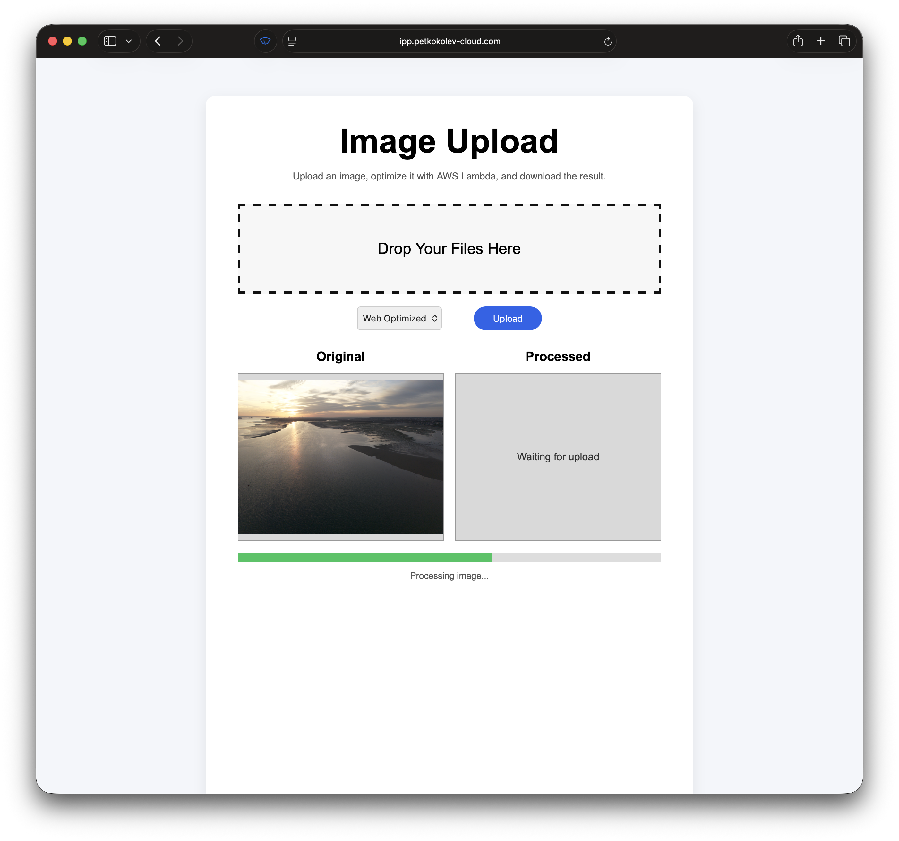
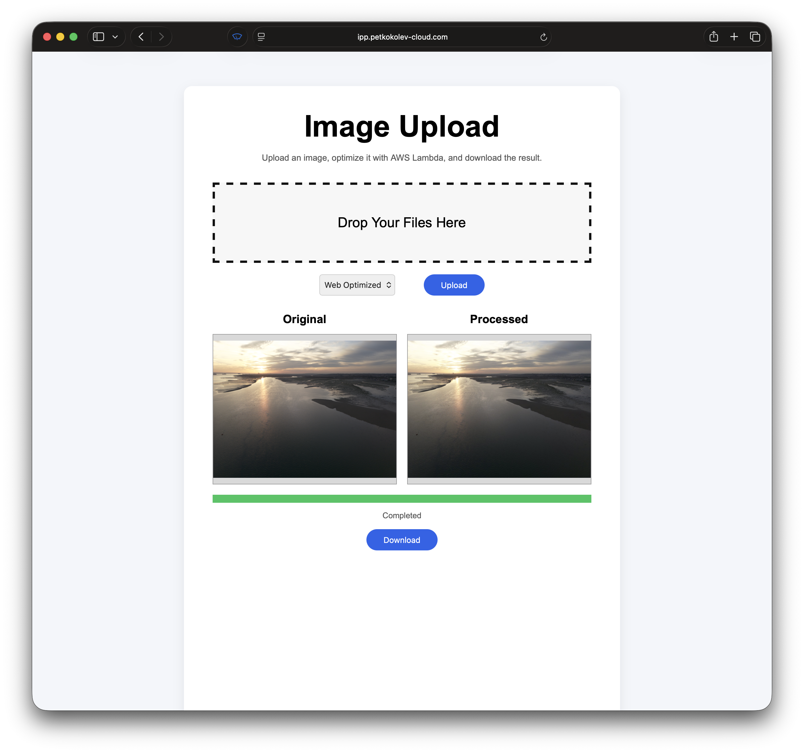
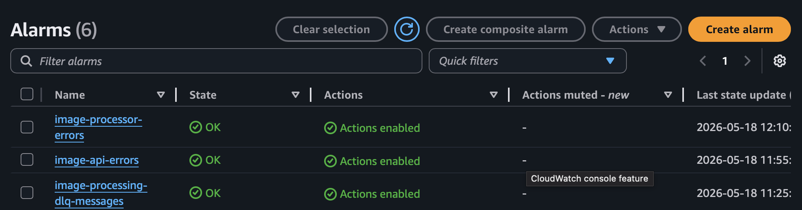
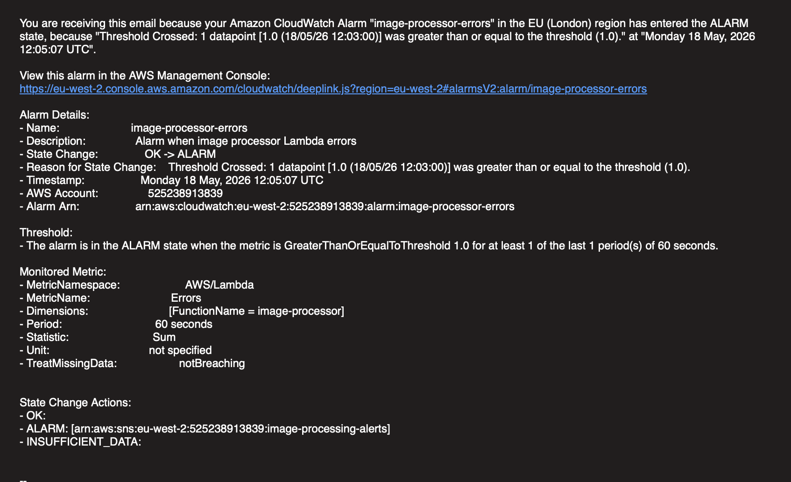
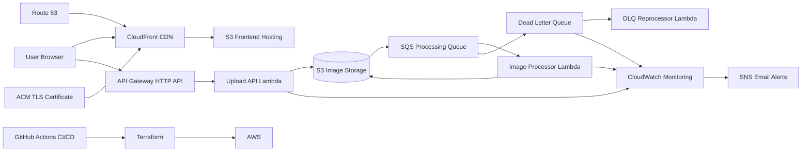

# AWS Event-Driven Image Processing Platform

Production-style serverless image processing platform built on AWS to demonstrate real-world cloud engineering skills including event-driven architecture, Infrastructure as Code, CI/CD automation, observability, and operational resilience.

## Live Demo

**Frontend (Custom Domain + HTTPS)**  
https://ipp.petkokolev-cloud.com

---

## Screenshots

### Frontend UI
Production browser interface for uploading and processing images.



---

### Processing Workflow
Image upload and asynchronous backend processing in progress.



---

### Completed Processing Result
Original vs processed output with downloadable result.



---

### Monitoring & Alerting
CloudWatch alarms for operational visibility.



---

### SNS Alert Notifications
Email alerting for production issue detection.



---

## Project Overview

This project began as a simple image processing concept and evolved into a production-style cloud engineering portfolio project designed to demonstrate practical AWS architecture and DevOps capability beyond beginner projects.

Users upload an image through a browser-based frontend, which is processed asynchronously by an event-driven AWS backend and returned as an optimized downloadable result.

This project demonstrates:

- Event-driven serverless architecture
- Asynchronous distributed processing
- API-driven cloud application design
- Infrastructure as Code with Terraform
- Automated CI/CD deployment with GitHub Actions
- Cloud monitoring and alerting with CloudWatch + SNS
- Operational resilience with SQS + Dead Letter Queue handling
- IAM least-privilege design
- Production-style HTTPS hosting with CloudFront + Route 53

---

## Architecture



---

## Application Features

### Frontend

- Drag-and-drop image uploads
- Click-to-upload file selection
- Instant original image preview
- Processed image preview after backend completion
- Upload progress indicator
- Status updates during processing
- Download processed image button
- Responsive browser UI

### Supported File Types

- JPG / JPEG
- PNG

### Processing Modes

- **Web Optimized** — compressed output for web delivery
- **Thumbnail** — resized image output
- **High Quality** — minimal compression output

### Additional Processing Features

- EXIF orientation correction for mobile uploads
- Original file format preservation where appropriate

---

## How It Works

### 1. Frontend Delivery

The static frontend is hosted on S3 and distributed globally through CloudFront with HTTPS enabled via ACM and Route 53 custom DNS.

User access flow:

```text
Browser → CloudFront → S3 frontend
```

---

### 2. Upload API Flow

The frontend requests a presigned upload URL from API Gateway:

```text
POST /upload
```

The API Lambda:

- validates file content type
- validates requested processing mode
- generates a presigned S3 upload URL
- returns the upload URL + generated object key

The browser uploads directly to S3.

This design avoids routing binary payloads through Lambda, improving scalability and reducing cost.

---

### 3. Event-Driven Processing

Uploaded images land in:

```text
uploads/
```

Flow:

```text
S3 Object Created Event
→ SQS Queue
→ Image Processor Lambda
```

The processing Lambda:

- downloads the uploaded image
- reads EXIF metadata
- corrects orientation if required
- detects processing mode
- applies Pillow transformations
- uploads processed output to:

```text
processed/
```

---

### 4. Retrieval Flow

The frontend polls:

```text
GET /image
```

The API Lambda:

- checks if processed output exists
- generates a presigned download URL
- returns the signed URL

The frontend renders the processed image preview and enables download.

---

## Engineering Decisions

### Direct Browser Uploads via Presigned URLs

Instead of uploading files through API Gateway/Lambda:

```text
Browser → API → Lambda → S3
```

this project uses:

```text
Browser → S3
```

Benefits:

- lower cost
- reduced Lambda execution time
- avoids payload size limitations
- improved scalability
- cleaner separation of responsibilities

---

### Event-Driven Async Processing

Processing is decoupled from upload requests using SQS.

Benefits:

- absorbs burst traffic
- improves resilience
- isolates failures
- supports retries
- reflects real cloud-native architecture patterns

---

### uploads/ vs processed/ Prefix Separation

Separate prefixes prevent recursive processing loops.

Without this:

- processed images could retrigger S3 events
- Lambda could process its own outputs
- infinite execution loops could occur
- AWS costs could spike unexpectedly

---

### Dead Letter Queue Pattern

Failed queue messages are routed to a DLQ after retry exhaustion.

Benefits:

- failure isolation
- safer async processing
- operational visibility
- reprocessing capability

---

### Least-Privilege IAM Roles

Rather than using a shared Lambda execution role, each function has a dedicated IAM role with scoped permissions.

Examples:

- API Lambda → S3 + logging
- Image processor → SQS + S3 + logging
- DLQ reprocessor → SQS + requeue + logging

This better reflects production security practices.

---

## Monitoring & Alerting

Operational monitoring is implemented using CloudWatch and SNS.

Current alerts:

- Image processor Lambda errors
- API Lambda errors
- DLQ message accumulation

Alert flow:

```text
CloudWatch Alarm → SNS Topic → Email Notification
```

This enables proactive operational visibility rather than reactive debugging.

---

## Infrastructure

Provisioned entirely using Terraform.

AWS resources include:

- S3 (frontend hosting)
- S3 (image storage)
- API Gateway HTTP API
- Lambda (upload API)
- Lambda (image processor)
- Lambda (DLQ reprocessor)
- SQS processing queue
- Dead Letter Queue
- IAM roles and policies
- CloudFront CDN
- Route 53 DNS
- ACM TLS certificate
- CloudWatch alarms
- SNS notifications
- Terraform remote state backend
- DynamoDB Terraform locking

---

## CI/CD

Deployment is automated using GitHub Actions.

Pipeline steps:

- checkout repository
- build Lambda deployment packages
- build Lambda-compatible Pillow dependencies via Docker
- package API Lambda
- Terraform infrastructure deployment
- frontend deployment to S3

Pushes to:

```text
main
```

automatically deploy changes.

---

## Challenges Solved

### Lambda Native Dependency Compatibility

Problem:

```text
_imaging import errors
```

Cause:

Dependencies built locally on macOS instead of Lambda-compatible Linux runtime.

Solution:

Dockerized dependency builds using:

```text
public.ecr.aws/lambda/python:3.11
```

---

### IAM Permission Debugging

Challenges encountered with:

- Lambda execution permissions
- Route 53 validation access
- ACM validation
- Terraform deployment permissions
- CloudWatch/SNS deployment permissions

Resolved through iterative IAM debugging and policy refinement.

---

### CloudFront Certificate Region Constraint

CloudFront requires ACM certificates in:

```text
us-east-1
```

while application infrastructure remains in:

```text
eu-west-2
```

Handled via Terraform provider aliasing.

---

### Mobile EXIF Orientation Issues

Problem:

Mobile uploads appeared rotated incorrectly.

Solution:

EXIF normalization during image processing.

---

### Browser Compatibility Issues

Safari-specific frontend rendering inconsistencies required frontend compatibility fixes.

## Tech Stack

### AWS

- S3
- CloudFront
- API Gateway
- Lambda
- SQS
- Dead Letter Queue
- IAM
- Route 53
- ACM
- CloudWatch
- SNS
- DynamoDB

### DevOps / Infrastructure

- Terraform
- GitHub Actions
- Docker

### Backend

- Python
- Pillow

### Frontend

- HTML
- CSS
- Vanilla JavaScript

---

## Future Improvements

Potential future enhancements:

- GitHub Actions OIDC authentication
- Terraform validation / plan gates in CI
- CloudFront Origin Access Control (private frontend bucket)
- API custom domain
- CloudWatch dashboard
- main SQS queue backlog monitoring
- API Gateway 5XX monitoring
- DynamoDB metadata tracking
- user authentication / access control
- batch image uploads
- WebP / AVIF support

---

## Portfolio Context

This project was built as a cloud engineering portfolio project to demonstrate practical AWS engineering capability beyond tutorial-level deployments.

It intentionally emphasizes:

- architecture design
- operational resilience
- infrastructure automation
- deployment workflows
- debugging real cloud integration issues
- production-oriented engineering decisions